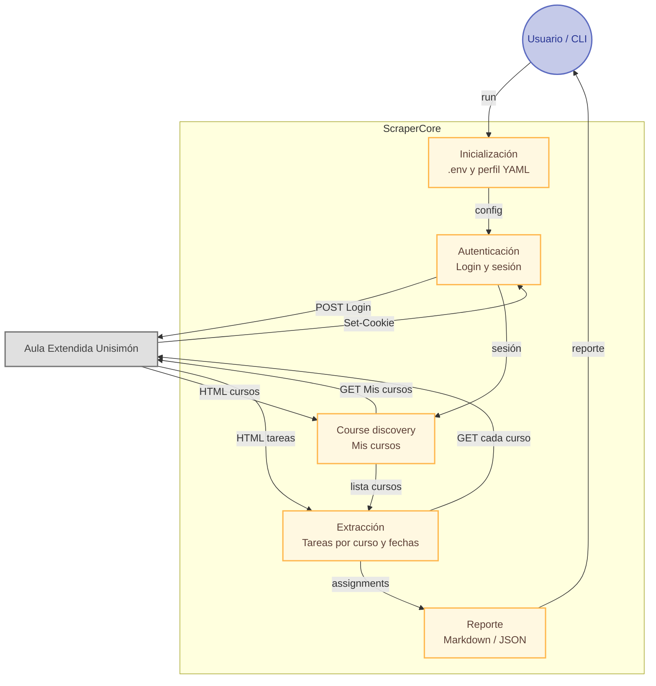

# 📚 Unisimon Portal Scraper / LMS Agent Scraper

<div align="center">

       

</div>

---

<div align="center">

**Extrae cursos y tareas próximas a entregar del Aula Extendida de la Universidad Simón Bolívar (Colombia).** Pensado como plantilla reutilizable para Aulas Extendidas (Moodle/LMS) de otras universidades: perfiles YAML, workflow LangGraph y servidor MCP.

</div>

---

**Forma recomendada de uso:** configurar `.env` (desde `.env.example`) y ejecutar el comando por defecto (véase [Inicio rápido](#-inicio-rápido) más abajo).

### 📍 Flujo del scraper (mapa)

El siguiente diagrama ilustra la interacción entre usuario, agentes y **Aula Extendida Unisimón**: se obtienen los cursos y las tareas próximas a entregar (flujo v2: auth → discovery → extracción → reporte).



---

## ⚡ Inicio rápido

La forma más sencilla de usar el proyecto es el comando **por defecto**, que usa los valores de tu `.env` (perfil, URL del portal, credenciales, días, etc.):

```bash
pip install -e .
playwright install chromium
```

Copia `.env.example` a `.env` y configura al menos: `PORTAL_PROFILE` (ej. `moodle_unisimon` para Aula Extendida Unisimón), `PORTAL_BASE_URL`, `PORTAL_USERNAME`, `PORTAL_PASSWORD`. Luego:

```bash
python -m lms_agent_scraper.cli run
```

**Valores por defecto:** se usa el perfil indicado en `PORTAL_PROFILE`, los días en `SCRAPER_DAYS_AHEAD` / `SCRAPER_DAYS_BEHIND`, y el reporte se escribe en `reports/`. Para Unisimon Aula Pregrado conviene `PORTAL_PROFILE=moodle_unisimon`. Sin argumentos adicionales, este comando es suficiente.

---

## 🛠️ Tecnologías, estándares y protocolos

Tabla por categoría de lo usado en la implementación del repo:

<table>
<thead>
<tr>
<th>Categoría</th>
<th>Tecnología / Estándar / Protocolo</th>
<th>Uso en el proyecto</th>
</tr>
</thead>
<tbody>
<tr>
<td style="background-color:#e3f2fd;">Lenguaje y runtime</td>
<td style="background-color:#e3f2fd;">Python 3.10+</td>
<td style="background-color:#e3f2fd;">Lenguaje principal; tipado y sintaxis modernos.</td>
</tr>
<tr>
<td style="background-color:#e8f5e9;">Orquestación</td>
<td style="background-color:#e8f5e9;">LangGraph</td>
<td style="background-color:#e8f5e9;">Grafo de estados: auth → discovery → extracción → reporte. <a href="docs/ORQUESTACION_LANGGRAPH_LANGCHAIN.md">Trabajo en conjunto con LangChain →</a></td>
</tr>
<tr>
<td style="background-color:#e8f5e9;">Orquestación</td>
<td style="background-color:#e8f5e9;">LangChain</td>
<td style="background-color:#e8f5e9;">Prompts (ChatPromptTemplate), mensajes (HumanMessage), integración con LLMs. <a href="docs/ORQUESTACION_LANGGRAPH_LANGCHAIN.md">Trabajo en conjunto con LangGraph →</a></td>
</tr>
<tr>
<td style="background-color:#fff3e0;">Automatización y scraping</td>
<td style="background-color:#fff3e0;">Playwright</td>
<td style="background-color:#fff3e0;">Navegador headless: login, “Mis cursos”, discovery y captura de HTML.</td>
</tr>
<tr>
<td style="background-color:#fff3e0;">Automatización y scraping</td>
<td style="background-color:#fff3e0;">BeautifulSoup4</td>
<td style="background-color:#fff3e0;">Parseo HTML: tarjetas de curso, assignments, fechas.</td>
</tr>
<tr>
<td style="background-color:#fff3e0;">Automatización y scraping</td>
<td style="background-color:#fff3e0;">lxml</td>
<td style="background-color:#fff3e0;">Parser rápido para BeautifulSoup.</td>
</tr>
<tr>
<td style="background-color:#fff3e0;">Automatización y scraping</td>
<td style="background-color:#fff3e0;">requests</td>
<td style="background-color:#fff3e0;">HTTP para páginas de curso (sesión autenticada).</td>
</tr>
<tr>
<td style="background-color:#f3e5f5;">LLM e IA</td>
<td style="background-color:#f3e5f5;">Ollama</td>
<td style="background-color:#f3e5f5;">Modelos locales para extracción de cursos y clasificación de páginas.</td>
</tr>
<tr>
<td style="background-color:#f3e5f5;">LLM e IA</td>
<td style="background-color:#f3e5f5;">langchain-ollama</td>
<td style="background-color:#f3e5f5;">Cliente ChatOllama e integración con LangChain.</td>
</tr>
<tr>
<td style="background-color:#e0f2f1;">Configuración</td>
<td style="background-color:#e0f2f1;">Pydantic / pydantic-settings</td>
<td style="background-color:#e0f2f1;">Modelos de configuración y validación desde .env (portal, scraper, Ollama).</td>
</tr>
<tr>
<td style="background-color:#e0f2f1;">Configuración</td>
<td style="background-color:#e0f2f1;">python-dotenv</td>
<td style="background-color:#e0f2f1;">Carga de variables de entorno desde .env.</td>
</tr>
<tr>
<td style="background-color:#e0f2f1;">Configuración</td>
<td style="background-color:#e0f2f1;">PyYAML</td>
<td style="background-color:#e0f2f1;">Perfiles por portal (selectores, auth, course_discovery) en profiles/.</td>
</tr>
<tr>
<td style="background-color:#e0f2f1;">Configuración</td>
<td style="background-color:#e0f2f1;">Typer</td>
<td style="background-color:#e0f2f1;">CLI: run, profiles list/validate.</td>
</tr>
<tr>
<td style="background-color:#e0f2f1;">Configuración</td>
<td style="background-color:#e0f2f1;">Rich</td>
<td style="background-color:#e0f2f1;">Salida enriquecida en terminal (opcional en CLI).</td>
</tr>
<tr>
<td style="background-color:#ffebee;">Protocolos</td>
<td style="background-color:#ffebee;">MCP (Model Context Protocol)</td>
<td style="background-color:#ffebee;">Servidor FastMCP vía stdio; herramientas get_courses, get_pending_assignments, etc.</td>
</tr>
<tr>
<td style="background-color:#ffebee;">Protocolos</td>
<td style="background-color:#ffebee;">HTTP/HTTPS</td>
<td style="background-color:#ffebee;">Comunicación con el portal LMS y con Ollama.</td>
</tr>
<tr>
<td style="background-color:#ffebee;">Protocolos</td>
<td style="background-color:#ffebee;">stdio</td>
<td style="background-color:#ffebee;">Transporte del servidor MCP para Cursor / Claude Desktop.</td>
</tr>
<tr>
<td style="background-color:#fafafa;">Formatos</td>
<td style="background-color:#fafafa;">YAML</td>
<td style="background-color:#fafafa;">Perfiles de portal y front matter en skills (SKILL.md).</td>
</tr>
<tr>
<td style="background-color:#fafafa;">Formatos</td>
<td style="background-color:#fafafa;">Markdown</td>
<td style="background-color:#fafafa;">Reportes de tareas y documentación de skills (SKILL.md).</td>
</tr>
<tr>
<td style="background-color:#fafafa;">Formatos</td>
<td style="background-color:#fafafa;">JSON</td>
<td style="background-color:#fafafa;">Respuestas estructuradas del LLM (cursos, fechas); respuestas MCP.</td>
</tr>
<tr>
<td style="background-color:#fafafa;">Formatos</td>
<td style="background-color:#fafafa;">HTML</td>
<td style="background-color:#fafafa;">Páginas del portal; parseo con BeautifulSoup y selectores CSS.</td>
</tr>
<tr>
<td style="background-color:#efebe9;">Estándares y prácticas</td>
<td style="background-color:#efebe9;">SOLID / DRY</td>
<td style="background-color:#efebe9;">Principios de diseño; ver docs/SOLID_AND_QUALITY.md.</td>
</tr>
<tr>
<td style="background-color:#efebe9;">Estándares y prácticas</td>
<td style="background-color:#efebe9;">Selectores CSS</td>
<td style="background-color:#efebe9;">Perfiles YAML (tarjetas, nombre, enlace, “Ver más”).</td>
</tr>
<tr>
<td style="background-color:#e1f5fe;">Desarrollo</td>
<td style="background-color:#e1f5fe;">pytest / pytest-asyncio</td>
<td style="background-color:#e1f5fe;">Tests en tests/.</td>
</tr>
<tr>
<td style="background-color:#e1f5fe;">Desarrollo</td>
<td style="background-color:#e1f5fe;">ruff</td>
<td style="background-color:#e1f5fe;">Linter y formateo (py310, line-length 100).</td>
</tr>
<tr>
<td style="background-color:#e1f5fe;">Desarrollo</td>
<td style="background-color:#e1f5fe;">setuptools / wheel</td>
<td style="background-color:#e1f5fe;">Empaquetado (pyproject.toml, pip install -e .).</td>
</tr>
<tr>
<td style="background-color:#fce4ec;">Portal objetivo</td>
<td style="background-color:#fce4ec;">Moodle (Aula Pregrado)</td>
<td style="background-color:#fce4ec;">Unisimon: aulapregrado.unisimon.edu.co; perfil moodle_unisimon.</td>
</tr>
</tbody>
</table>

## 🚀 Características

- ✅ Autenticación automática en el portal (Playwright)
- 📅 Filtrado de tareas por período personalizable (días adelante/atrás)
- 📊 Generación de reportes en formato Markdown
- 🔍 Modo debug para análisis del portal
- 🛠️ **v2:** Workflow LangGraph (auth → discovery → extracción → reporte), perfiles YAML, MCP
- 🛠️ **v2:** Detección de cursos: BeautifulSoup (principal), LLM (Ollama) y Playwright como respaldo; detección de presencia de tarjetas; fallback por contenido (visitar enlaces y clasificar con LLM)

## 📁 Estructura del Proyecto

```
unisimon_scraper/
├── pyproject.toml          # Paquete instalable: pip install -e .
├── .env.example            # Plantilla de variables para v2 (copiar a .env)
├── profiles/               # Perfiles YAML por portal (v2)
│   ├── moodle_unisimon.yml
│   ├── moodle_default.yml
│   └── ...
├── src/lms_agent_scraper/  # LMS Agent Scraper (v2)
│   ├── cli.py              # Comandos: run, profiles list/validate
│   ├── agents/             # Agentes (login, course discovery, analyzer)
│   ├── graph/              # Workflow LangGraph (nodes, workflow, state)
│   ├── llm/                # Cliente Ollama (extracción y clasificación)
│   ├── tools/              # browser_tools, extraction_tools, report_tools
│   ├── core/               # date_parser, profile_loader, skill_loader
│   ├── skills/             # Prompts LLM en SKILL.md (date-interpreter, course-extractor, etc.)
│   └── mcp/                # Servidor MCP
├── validate_skills.py      # Valida que los skills (SKILL.md) carguen correctamente
├── .agents/skills/         # Skills de skills.sh (agent-browser, pdf, webapp-testing, etc.)
├── docs/
│   ├── AGENT_SKILLS.md
│   ├── ARCHITECTURE_VERIFICATION.md
│   └── SOLID_AND_QUALITY.md
├── tests/
└── reports/                # Reportes Markdown generados
```

### 📤 Salida

El comando **`python -m lms_agent_scraper.cli run`** genera:

1. **Reporte Markdown** en `reports/assignments_report_YYYYMMDD_HHMMSS.md`
2. **Archivos de Debug** en `debug_html/` si está habilitado (`SCRAPER_DEBUG_MODE=true` en `.env`)
3. **Mensajes en consola** con el progreso y resultados

## 📊 Formato del Reporte

El reporte incluye:

- 📅 Fecha de generación y período consultado
- 📖 Tareas agrupadas por curso
- ⏰ Fechas de entrega con indicadores de urgencia
- 📝 Descripciones y requisitos de cada tarea
- 🔢 Conteo total de tareas encontradas

## 🔧 Solución de Problemas

### 🔐 Error de Autenticación

Si el login falla:

1. Verifica `PORTAL_BASE_URL`, `PORTAL_USERNAME` y `PORTAL_PASSWORD` en `.env`.
2. Comprueba que la URL del portal sea correcta y revisa `debug_html/` si está habilitado.

### 📭 No se Encuentran Tareas

Si no se encuentran tareas:

1. **Portal con JavaScript**: El portal podría usar JavaScript para cargar contenido dinámicamente
2. **Estructura cambiada**: El portal podría haber cambiado su estructura HTML
3. **Sin tareas**: Realmente no hay tareas en el período consultado
4. **Unisimon**: Si usas el scraper con Unisimon Aula Pregrado, pon `PORTAL_PROFILE=moodle_unisimon` en `.env`. Con `moodle_default` puede que no se detecten las tarjetas de curso. Para depurar: `SCRAPER_DEBUG_MODE=true` y revisar `debug_html/courses_page.html`.

## 📝 Notas Importantes

- ⚠️ **Uso Responsable**: Este scraper es para uso personal únicamente
- 🔒 **Seguridad**: Credenciales en `.env`. No versionar `.env`. Ver `.env.example` y `ENV_README.md`.
- 📊 **Limitaciones**: Depende de la estructura HTML del portal
- 🔄 **Mantenimiento**: Puede requerir actualizaciones si el portal cambia

## 🆘 Soporte

Si encuentras problemas:

1. Asegúrate de usar **`python -m lms_agent_scraper.cli run`** con `.env` configurado (véase [Inicio rápido](#-inicio-rápido)).
2. Revisa los archivos de debug en `debug_html/` (con `SCRAPER_DEBUG_MODE=true` en `.env`).
3. Verifica dependencias (`pip install -e .`, `playwright install chromium`) y credenciales en `.env`.

---

## 🚀 LMS Agent Scraper (v2)

El comando por defecto **`python -m lms_agent_scraper.cli run`** es la forma más sencilla de uso (véase [Inicio rápido](#-inicio-rápido)).

### 📋 Requisitos

- Python 3.10+
- `pip install -e .` y `playwright install chromium`
- Variables de entorno en `.env` (copiar desde `.env.example`)

### ⚙️ Configuración (v2)

1. Copiar `.env.example` a `.env` y configurar:
   - `PORTAL_PROFILE` (ej: `moodle_unisimon` o `moodle_default`). **Para Unisimon Aula Pregrado (aulapregrado.unisimon.edu.co) usar `moodle_unisimon`.**
   - `PORTAL_BASE_URL`, `PORTAL_USERNAME`, `PORTAL_PASSWORD`
   - Opcional: `SCRAPER_DAYS_AHEAD`, `SCRAPER_DAYS_BEHIND`, `SCRAPER_MAX_COURSES`, `SCRAPER_OUTPUT_DIR`, `SCRAPER_DEBUG_MODE` (guardar HTML en `debug_html/` y más logs)
   - Opcional (Ollama): `OLLAMA_BASE_URL`, `OLLAMA_MODEL_NAME`, `OLLAMA_TEMPERATURE`, `OLLAMA_NUM_CTX`, `OLLAMA_NUM_PREDICT` — usado para extraer la lista de cursos desde el HTML, clasificar páginas como “curso” en el discovery por contenido y (en el futuro) sugerir selectores. Requiere Ollama en ejecución y un modelo (p. ej. `ollama run glm-4.7-flash`). Ver [ollama.com/library/glm-4.7-flash](https://ollama.com/library/glm-4.7-flash). Si no está disponible, la extracción se hace con BeautifulSoup y Playwright.

2. 📁 Perfiles YAML en `profiles/` definen selectores, auth y opciones por portal (Moodle, Canvas, etc.). El perfil `moodle_unisimon` está ajustado para Unisimon Aula Pregrado e incluye `course_discovery` para el fallback por contenido.

### 🔍 Detección de cursos (v2)

En la página "Mis cursos" del portal, la lista de cursos se obtiene en este orden:

1. **Enlaces por segmento de URL** — método principal: se buscan todos los enlaces cuya URL tenga en **algún segmento del path** una de las palabras clave configuradas (p. ej. `course`, `courses`, `cursos`). La comparación es **case-insensitive**. No depende de clases ni selectores CSS. Se configura con `course_link_segments` (lista) o `course_link_segment` (singular) en el perfil; si no se define, se usa por defecto `["course", "courses", "cursos"]`.
2. **BeautifulSoup (HTML)** — respaldo: se parsea el HTML con los selectores del perfil (tarjetas, nombre, enlace; ver esquema del bloque `courses` más abajo).
3. **LLM (Ollama)** — respaldo: si BeautifulSoup no devuelve cursos y Ollama está disponible, se envía un fragmento del HTML al modelo configurado para que devuelva un JSON con la lista de cursos (nombre y URL).
4. **Playwright** — respaldo: primero se prueban todos los enlaces de la página filtrados por las mismas palabras de segmento; si no hay resultados, se usan los locators del perfil (`courses.selectors`) dentro del contenedor opcional (`courses.container`).
5. **Discovery por contenido** — fallback opcional (perfil `course_discovery.fallback_when_empty: true`): si sigue habiendo 0 cursos, se extraen enlaces candidatos, se visitan y el LLM clasifica si son páginas de curso. Configurable con `max_candidates` y `candidate_patterns`.

Antes de extraer, se detecta la presencia de tarjetas de curso (`detect_courses_presence`) y, si el perfil lo indica, se puede expandir "Ver más" / paginación (`more_navigation`) antes de capturar el HTML.

#### 📐 Esquema del bloque `courses` en el perfil

Todos los campos son **opcionales**. Si no se definen, se usan valores por defecto compatibles con Moodle (block_myoverview / tarjetas). Así puedes reutilizar el mismo código en otros portales (Canvas, Blackboard, Moodle custom) solo configurando el perfil.

<table>
<colgroup><col style="width: 38%"><col style="width: 42%"><col style="width: 20%"></colgroup>
<thead>
<tr><th>Campo</th><th>Descripción</th><th>Por defecto (Moodle)</th></tr>
</thead>
<tbody>
<tr><td><code>course_link_segments</code></td><td>Lista de palabras que identifican un enlace a curso si aparecen en algún segmento del path de la URL (case-insensitive). Ej.: <code>["course", "courses", "cursos"]</code>.</td><td><code>["course", "courses", "cursos"]</code></td></tr>
<tr><td><code>course_link_segment</code></td><td>Alternativa en singular (una sola palabra); se convierte en lista de un elemento.</td><td>—</td></tr>
<tr><td><code>container</code></td><td>Contenedor opcional para acotar la búsqueda (Playwright).</td><td><code>[data-region='courses-view']</code></td></tr>
<tr><td><code>selectors</code></td><td>Lista de selectores CSS para enlaces a curso (Playwright).</td><td><code>a[href*='course/view.php']</code></td></tr>
<tr><td><code>card_selectors</code></td><td>Selectores que identifican una tarjeta/ítem de curso (BeautifulSoup y detección de presencia).</td><td><code>[data-region='course-content']</code>, <code>div.card.course-card</code></td></tr>
<tr><td><code>name_selectors</code></td><td>Dentro de cada tarjeta, selectores para el nombre del curso (texto o <code>title</code>).</td><td><code>a.coursename</code>, <code>span.multiline</code>, <code>[title]</code></td></tr>
<tr><td><code>link_selector</code></td><td>Dentro de cada tarjeta, selector del enlace al curso.</td><td>Enlace cuyo <code>href</code> cumple <code>link_href_pattern</code></td></tr>
<tr><td><code>link_href_pattern</code></td><td>Patrón que debe aparecer en el <code>href</code> (ej. <code>course/view</code>, <code>/course/</code>).</td><td><code>course/view</code></td></tr>
<tr><td><code>fallback_containers</code></td><td>Si no hay tarjetas, buscar enlaces dentro de estos contenedores.</td><td><code>[data-region='courses-view']</code>, <code>.card-deck</code>, <code>.course-box</code></td></tr>
<tr><td><code>more_navigation</code></td><td>Objeto opcional para "Ver más" / paginación antes de extraer.</td><td>No se expande</td></tr>
<tr><td><code>more_navigation.selectors</code></td><td>Lista de selectores (ej. <code>button:has-text('Ver más')</code>, <code>a:has-text('Siguiente')</code>).</td><td>—</td></tr>
<tr><td><code>more_navigation.expand_before_extract</code></td><td>Si <code>true</code>, hacer click en los controles antes de capturar HTML.</td><td><code>false</code></td></tr>
<tr><td><code>more_navigation.max_clicks</code></td><td>Número máximo de clicks en "Ver más" / siguiente.</td><td><code>0</code></td></tr>
</tbody>
</table>

### ▶️ Uso (v2)

**Comando por defecto (el más sencillo):**

```bash
python -m lms_agent_scraper.cli run
```

Usa el perfil y el resto de opciones definidos en `.env`. No hace falta pasar argumentos; con tener `.env` configurado basta.

**Otros comandos:**

```bash
# Perfil explícito por línea de comandos (sobrescribe PORTAL_PROFILE del .env)
python -m lms_agent_scraper.cli run --profile moodle_unisimon

# Listar y validar perfiles
python -m lms_agent_scraper.cli profiles list
python -m lms_agent_scraper.cli profiles validate moodle_unisimon

# Modo debug: SCRAPER_DEBUG_MODE=true en .env (guarda HTML en debug_html/ y más logs)

# Tests (desde la raíz del repo)
pytest tests/ -v
```

### 🔌 MCP Server (Cursor / Claude Desktop)

En la configuración MCP del cliente:

```json
{
  "mcpServers": {
    "lms-scraper": {
      "command": "python",
      "args": ["-m", "lms_agent_scraper.mcp.server"],
      "env": {
        "PORTAL_PROFILE": "moodle_unisimon",
        "PORTAL_BASE_URL": "${env:PORTAL_BASE_URL}",
        "PORTAL_USERNAME": "${env:PORTAL_USERNAME}",
        "PORTAL_PASSWORD": "${env:PORTAL_PASSWORD}"
      }
    }
  }
}
```

🛠️ Herramientas expuestas: `get_pending_assignments`, `get_submitted_assignments`, `get_courses`, `generate_report`, `check_deadlines`, `list_profiles`. El servidor envía `instructions` al cliente indicando que se trata del portal LMS de la **Universidad Simón Bolívar (Unisimon), Aula Pregrado**, para que el agente tenga ese contexto.

### 💻 Desarrollo con Cursor

Este proyecto se desarrolla con Cursor. Se usan **reglas globales** en `~/.cursor/rules/` (aplican a todos los proyectos):

- **SOLID y calidad**: `solid-and-quality.mdc` — principios SOLID, DRY y buenas prácticas. Copia en el repo: [docs/SOLID_AND_QUALITY.md](docs/SOLID_AND_QUALITY.md). Verificación de cumplimiento: [docs/ARCHITECTURE_VERIFICATION.md](docs/ARCHITECTURE_VERIFICATION.md).
- **Idioma**: `comments-spanish-code-english.mdc` — comentarios y docstrings en español; nombres de código en inglés.

**MCPs opcionales** (instalados en `C:\MCPs\` y configurados en `~/.cursor/mcp.json`):

| MCP | Descripción |
|-----|-------------|
| **pdf-reader** | Lee texto de archivos PDF. |
| **char-counter** | Cuenta caracteres, palabras y líneas en texto o archivo. |
| **unused-vars** | Analiza código Python y detecta variables/funciones no usadas y variables de entorno referenciadas; opcionalmente compara con un `.env`. |

Para analizar este repo con unused-vars (y opcionalmente el `.env`), el agente puede llamar a la herramienta `analyze_unused` con `path` al directorio del proyecto y `env_file` al `.env`.

### 🧩 Agent Skills (skills.sh)

Para mejorar el comportamiento de agentes al trabajar con este repo, instala skills desde [skills.sh](https://skills.sh/). Se instalan en **`.agents/skills/`** y **Cursor (y otros agentes compatibles) los usan automáticamente** al trabajar en este repositorio. En `docs/AGENT_SKILLS.md` encontrarás la lista por prioridad, la tabla labores–skills y la integración con los agentes.

**Esenciales:** `vercel-labs/agent-browser`, `anthropics/skills` (incluye pdf y webapp-testing). **Recomendados:** `browser-use/browser-use`, `obra/superpowers`. **Opcionales:** `wshobson/agents`.

```bash
npx skills add vercel-labs/agent-browser --yes
npx skills add anthropics/skills --yes
npx skills add browser-use/browser-use --yes
npx skills add obra/superpowers --yes
```

Ver `docs/AGENT_SKILLS.md` para todos los comandos y `npx skills list` para listar los instalados.

**Skills en tiempo de ejecución (prompts del LLM):** Los prompts que usa Ollama están en `src/lms_agent_scraper/skills/` (archivos SKILL.md por tarea: extracción de cursos, fechas, selectores, etc.). Puedes editarlos sin tocar código. Para validar que carguen bien: `python validate_skills.py`. Detalle en `docs/AGENT_SKILLS.md` (sección "Skills en tiempo de ejecución").

---

## 📄 Licencia

Este proyecto es para uso educativo y personal únicamente.
